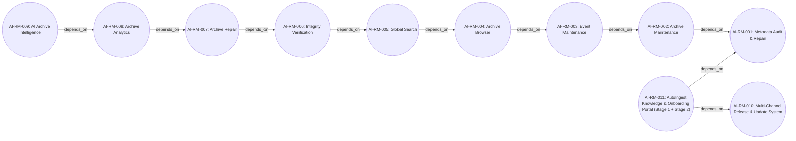
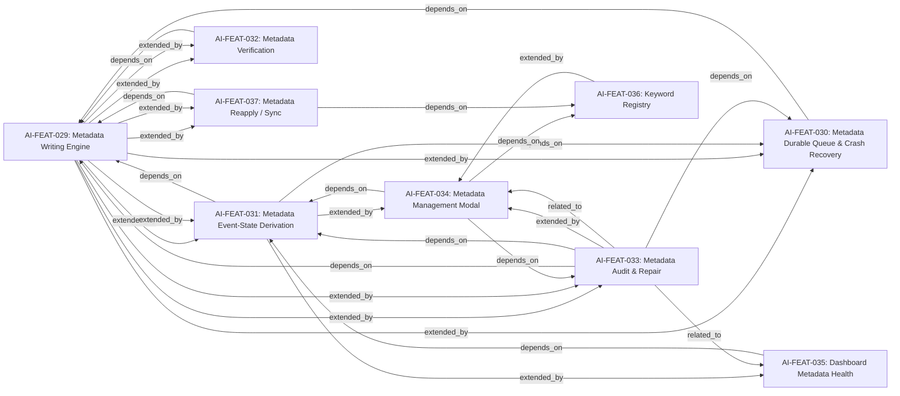
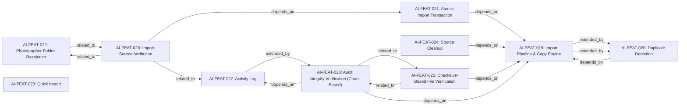
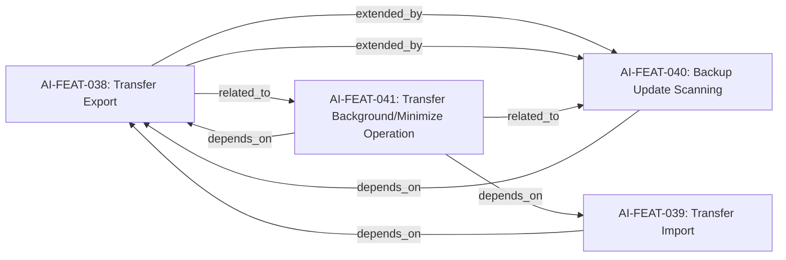
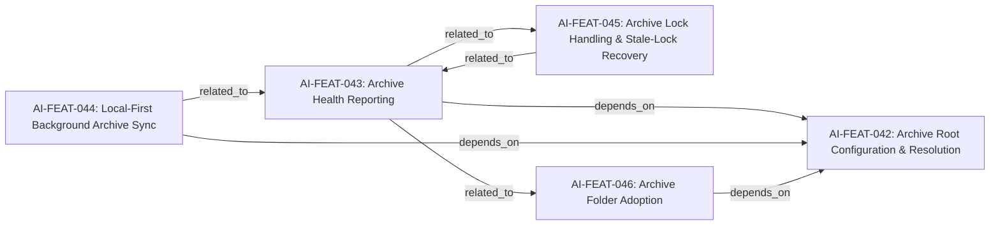

# Dependency Graph

> Generated artifact — locator only. Regenerate with `node scripts/product-docs/cli.js build`. Full machine-readable graph: `dependency-graph.json`. Views below are deliberately bounded (one subsystem or milestone chain per diagram) rather than one unreadable graph of every node.

Total: 127 nodes, 560 edges.

### Roadmap milestone relationships

11 node(s), 10 edge(s) in this view.

### Feature dependency overview (features with a depends_on/extended_by edge)

54 node(s), 151 edge(s) in this view.

```mermaid
flowchart LR
  %% Feature dependency overview (features with a depends_on/extended_by edge)
  AI_FEAT_002["AI-FEAT-002: Login & Operator Identity"]
  AI_FEAT_003["AI-FEAT-003: Dashboard & System Status"]
  AI_FEAT_004["AI-FEAT-004: event.json Data Model & Persistence Contract"]
  AI_FEAT_005["AI-FEAT-005: Application Settings & Configuration Store"]
  AI_FEAT_006["AI-FEAT-006: Application Auto-Update"]
  AI_FEAT_007["AI-FEAT-007: Telemetry Pipeline"]
  AI_FEAT_008["AI-FEAT-008: Design System & UI Consistency Framework"]
  AI_FEAT_009["AI-FEAT-009: Event Creation"]
  AI_FEAT_010["AI-FEAT-010: Event Management & Editing"]
  AI_FEAT_011["AI-FEAT-011: Source Detection (Drives, DCIM, Sony PRIVATE)"]
  AI_FEAT_012["AI-FEAT-012: Source Selection (Local Folder / External Drive)"]
  AI_FEAT_013["AI-FEAT-013: File Browser & Media Grid/List Viewing"]
  AI_FEAT_015["AI-FEAT-015: Media Preview"]
  AI_FEAT_016["AI-FEAT-016: Preview Focus / Selection Separation"]
  AI_FEAT_017["AI-FEAT-017: Grouping System"]
  AI_FEAT_018["AI-FEAT-018: Event-Component Import Routing"]
  AI_FEAT_019["AI-FEAT-019: Import Pipeline & Copy Engine"]
  AI_FEAT_020["AI-FEAT-020: Duplicate Detection"]
  AI_FEAT_021["AI-FEAT-021: Atomic Import Transaction"]
  AI_FEAT_022["AI-FEAT-022: Photographer-Folder Resolution"]
  AI_FEAT_023["AI-FEAT-023: Quick Import"]
  AI_FEAT_024["AI-FEAT-024: Source Cleanup"]
  AI_FEAT_025["AI-FEAT-025: Checksum-Based File Verification"]
  AI_FEAT_026["AI-FEAT-026: Audit Integrity Verification (Count-Based)"]
  AI_FEAT_027["AI-FEAT-027: Activity Log"]
  AI_FEAT_028["AI-FEAT-028: Import Source Attribution"]
  AI_FEAT_029["AI-FEAT-029: Metadata Writing Engine"]
  AI_FEAT_030["AI-FEAT-030: Metadata Durable Queue & Crash Recovery"]
  AI_FEAT_031["AI-FEAT-031: Metadata Event-State Derivation"]
  AI_FEAT_032["AI-FEAT-032: Metadata Verification"]
  AI_FEAT_033["AI-FEAT-033: Metadata Audit & Repair"]
  AI_FEAT_034["AI-FEAT-034: Metadata Management Modal"]
  AI_FEAT_035["AI-FEAT-035: Dashboard Metadata Health"]
  AI_FEAT_036["AI-FEAT-036: Keyword Registry"]
  AI_FEAT_037["AI-FEAT-037: Metadata Reapply / Sync"]
  AI_FEAT_038["AI-FEAT-038: Transfer Export"]
  AI_FEAT_039["AI-FEAT-039: Transfer Import"]
  AI_FEAT_040["AI-FEAT-040: Backup Update Scanning"]
  AI_FEAT_041["AI-FEAT-041: Transfer Background/Minimize Operation"]
  AI_FEAT_042["AI-FEAT-042: Archive Root Configuration & Resolution"]
  AI_FEAT_043["AI-FEAT-043: Archive Health Reporting"]
  AI_FEAT_044["AI-FEAT-044: Local-First Background Archive Sync"]
  AI_FEAT_046["AI-FEAT-046: Archive Folder Adoption"]
  AI_FEAT_047["AI-FEAT-047: QMZ Sequencing Workspace"]
  AI_FEAT_048["AI-FEAT-048: Realtime Team Presence & Online Registry"]
  AI_FEAT_049["AI-FEAT-049: Archive Maintenance"]
  AI_FEAT_050["AI-FEAT-050: Event Maintenance"]
  AI_FEAT_051["AI-FEAT-051: Archive Browser"]
  AI_FEAT_052["AI-FEAT-052: Archive Repair"]
  AI_FEAT_053["AI-FEAT-053: Global Search"]
  AI_FEAT_054["AI-FEAT-054: Integrity Verification — Archive-Wide"]
  AI_FEAT_055["AI-FEAT-055: Archive Analytics"]
  AI_FEAT_056["AI-FEAT-056: AI Archive Intelligence"]
  AI_FEAT_057["AI-FEAT-057: Multi-Channel Release & Update System"]
  AI_FEAT_002 -->|depends_on| AI_FEAT_005
  AI_FEAT_002 -->|related_to| AI_FEAT_022
  AI_FEAT_002 -->|related_to| AI_FEAT_027
  AI_FEAT_002 -->|related_to| AI_FEAT_028
  AI_FEAT_003 -->|depends_on| AI_FEAT_004
  AI_FEAT_003 -->|related_to| AI_FEAT_031
  AI_FEAT_003 -->|related_to| AI_FEAT_034
  AI_FEAT_003 -->|related_to| AI_FEAT_035
  AI_FEAT_004 -->|related_to| AI_FEAT_021
  AI_FEAT_005 -->|related_to| AI_FEAT_002
  AI_FEAT_005 -->|related_to| AI_FEAT_004
  AI_FEAT_005 -->|related_to| AI_FEAT_029
  AI_FEAT_005 -->|extended_by| AI_FEAT_042
  AI_FEAT_005 -->|related_to| AI_FEAT_042
  AI_FEAT_005 -->|related_to| AI_FEAT_048
  AI_FEAT_006 -->|depends_on| AI_FEAT_005
  AI_FEAT_006 -->|depends_on| AI_FEAT_007
  AI_FEAT_006 -->|extended_by| AI_FEAT_057
  AI_FEAT_006 -->|extended_by| AI_FEAT_057
  AI_FEAT_007 -->|depends_on| AI_FEAT_005
  AI_FEAT_007 -->|depends_on| AI_FEAT_006
  AI_FEAT_008 -->|related_to| AI_FEAT_016
  AI_FEAT_008 -->|related_to| AI_FEAT_034
  AI_FEAT_009 -->|depends_on| AI_FEAT_004
  AI_FEAT_009 -->|related_to| AI_FEAT_008
  AI_FEAT_009 -->|depends_on| AI_FEAT_018
  AI_FEAT_010 -->|depends_on| AI_FEAT_004
  AI_FEAT_010 -->|depends_on| AI_FEAT_009
  AI_FEAT_011 -->|related_to| AI_FEAT_012
  AI_FEAT_012 -->|depends_on| AI_FEAT_011
  AI_FEAT_012 -->|related_to| AI_FEAT_024
  AI_FEAT_013 -->|depends_on| AI_FEAT_017
  AI_FEAT_015 -->|depends_on| AI_FEAT_016
  AI_FEAT_016 -->|related_to| AI_FEAT_008
  AI_FEAT_017 -->|depends_on| AI_FEAT_004
  AI_FEAT_018 -->|depends_on| AI_FEAT_004
  AI_FEAT_018 -->|depends_on| AI_FEAT_009
  AI_FEAT_018 -->|depends_on| AI_FEAT_017
  AI_FEAT_019 -->|depends_on| AI_FEAT_004
  AI_FEAT_019 -->|depends_on| AI_FEAT_018
  AI_FEAT_019 -->|extended_by| AI_FEAT_020
  AI_FEAT_019 -->|extended_by| AI_FEAT_020
  AI_FEAT_019 -->|related_to| AI_FEAT_038
  AI_FEAT_019 -->|related_to| AI_FEAT_039
  AI_FEAT_019 -->|related_to| AI_FEAT_044
  AI_FEAT_020 -->|depends_on| AI_FEAT_019
  AI_FEAT_021 -->|depends_on| AI_FEAT_004
  AI_FEAT_021 -->|depends_on| AI_FEAT_019
  AI_FEAT_022 -->|related_to| AI_FEAT_002
  AI_FEAT_022 -->|depends_on| AI_FEAT_018
  AI_FEAT_022 -->|related_to| AI_FEAT_028
  AI_FEAT_023 -->|depends_on| AI_FEAT_004
  AI_FEAT_023 -->|related_to| AI_FEAT_009
  AI_FEAT_023 -->|related_to| AI_FEAT_029
  AI_FEAT_023 -->|related_to| AI_FEAT_033
  AI_FEAT_024 -->|depends_on| AI_FEAT_012
  AI_FEAT_024 -->|depends_on| AI_FEAT_019
  AI_FEAT_025 -->|depends_on| AI_FEAT_019
  AI_FEAT_025 -->|related_to| AI_FEAT_026
  AI_FEAT_025 -->|related_to| AI_FEAT_044
  AI_FEAT_025 -->|related_to| AI_FEAT_054
  AI_FEAT_026 -->|depends_on| AI_FEAT_019
  AI_FEAT_026 -->|related_to| AI_FEAT_025
  AI_FEAT_026 -->|depends_on| AI_FEAT_027
  AI_FEAT_027 -->|depends_on| AI_FEAT_004
  AI_FEAT_027 -->|depends_on| AI_FEAT_010
  AI_FEAT_027 -->|extended_by| AI_FEAT_026
  AI_FEAT_028 -->|related_to| AI_FEAT_002
  AI_FEAT_028 -->|depends_on| AI_FEAT_012
  AI_FEAT_028 -->|depends_on| AI_FEAT_021
  AI_FEAT_028 -->|related_to| AI_FEAT_022
  AI_FEAT_028 -->|related_to| AI_FEAT_027
  AI_FEAT_029 -->|depends_on| AI_FEAT_004
  AI_FEAT_029 -->|extended_by| AI_FEAT_030
  AI_FEAT_029 -->|extended_by| AI_FEAT_030
  AI_FEAT_029 -->|extended_by| AI_FEAT_031
  AI_FEAT_029 -->|extended_by| AI_FEAT_031
  AI_FEAT_029 -->|extended_by| AI_FEAT_032
  AI_FEAT_029 -->|extended_by| AI_FEAT_032
  AI_FEAT_029 -->|extended_by| AI_FEAT_033
  AI_FEAT_029 -->|extended_by| AI_FEAT_033
  AI_FEAT_029 -->|extended_by| AI_FEAT_037
  AI_FEAT_029 -->|extended_by| AI_FEAT_037
  AI_FEAT_030 -->|depends_on| AI_FEAT_029
  AI_FEAT_031 -->|depends_on| AI_FEAT_029
  AI_FEAT_031 -->|depends_on| AI_FEAT_030
  AI_FEAT_031 -->|extended_by| AI_FEAT_034
  AI_FEAT_031 -->|extended_by| AI_FEAT_035
  AI_FEAT_032 -->|depends_on| AI_FEAT_029
  AI_FEAT_032 -->|depends_on| AI_FEAT_039
  AI_FEAT_033 -->|depends_on| AI_FEAT_029
  AI_FEAT_033 -->|depends_on| AI_FEAT_030
  AI_FEAT_033 -->|depends_on| AI_FEAT_031
  AI_FEAT_033 -->|extended_by| AI_FEAT_034
  AI_FEAT_033 -->|related_to| AI_FEAT_034
  AI_FEAT_033 -->|related_to| AI_FEAT_035
  AI_FEAT_033 -->|related_to| AI_FEAT_052
  AI_FEAT_033 -->|related_to| AI_FEAT_054
  AI_FEAT_034 -->|depends_on| AI_FEAT_008
  AI_FEAT_034 -->|depends_on| AI_FEAT_031
  AI_FEAT_034 -->|depends_on| AI_FEAT_033
  AI_FEAT_034 -->|depends_on| AI_FEAT_036
  AI_FEAT_035 -->|depends_on| AI_FEAT_003
  AI_FEAT_035 -->|depends_on| AI_FEAT_031
  AI_FEAT_036 -->|extended_by| AI_FEAT_034
  AI_FEAT_037 -->|depends_on| AI_FEAT_029
  AI_FEAT_037 -->|depends_on| AI_FEAT_036
  AI_FEAT_038 -->|extended_by| AI_FEAT_040
  AI_FEAT_038 -->|extended_by| AI_FEAT_040
  AI_FEAT_038 -->|related_to| AI_FEAT_041
  AI_FEAT_038 -->|depends_on| AI_FEAT_042
  AI_FEAT_038 -->|related_to| AI_FEAT_046
  AI_FEAT_039 -->|depends_on| AI_FEAT_032
  AI_FEAT_039 -->|depends_on| AI_FEAT_038
  AI_FEAT_039 -->|depends_on| AI_FEAT_042
  AI_FEAT_040 -->|depends_on| AI_FEAT_038
  AI_FEAT_041 -->|depends_on| AI_FEAT_038
  AI_FEAT_041 -->|depends_on| AI_FEAT_039
  AI_FEAT_041 -->|related_to| AI_FEAT_040
  AI_FEAT_042 -->|depends_on| AI_FEAT_005
  AI_FEAT_043 -->|depends_on| AI_FEAT_004
  AI_FEAT_043 -->|depends_on| AI_FEAT_042
  AI_FEAT_043 -->|related_to| AI_FEAT_046
  AI_FEAT_043 -->|related_to| AI_FEAT_052
  AI_FEAT_044 -->|depends_on| AI_FEAT_019
  AI_FEAT_044 -->|related_to| AI_FEAT_029
  AI_FEAT_044 -->|depends_on| AI_FEAT_042
  AI_FEAT_044 -->|related_to| AI_FEAT_043
  AI_FEAT_046 -->|depends_on| AI_FEAT_004
  AI_FEAT_046 -->|depends_on| AI_FEAT_042
  AI_FEAT_046 -->|related_to| AI_FEAT_047
  AI_FEAT_047 -->|related_to| AI_FEAT_016
  AI_FEAT_047 -->|depends_on| AI_FEAT_029
  AI_FEAT_047 -->|related_to| AI_FEAT_046
  AI_FEAT_048 -->|depends_on| AI_FEAT_005
  AI_FEAT_049 -->|depends_on| AI_FEAT_042
  AI_FEAT_049 -->|depends_on| AI_FEAT_043
  AI_FEAT_049 -->|extended_by| AI_FEAT_050
  AI_FEAT_049 -->|extended_by| AI_FEAT_050
  AI_FEAT_050 -->|depends_on| AI_FEAT_004
  AI_FEAT_050 -->|depends_on| AI_FEAT_010
  AI_FEAT_051 -->|depends_on| AI_FEAT_013
  AI_FEAT_052 -->|depends_on| AI_FEAT_043
  AI_FEAT_053 -->|depends_on| AI_FEAT_051
  AI_FEAT_054 -->|depends_on| AI_FEAT_025
  AI_FEAT_055 -->|depends_on| AI_FEAT_043
  AI_FEAT_056 -->|depends_on| AI_FEAT_055
  AI_FEAT_057 -->|depends_on| AI_FEAT_005
  AI_FEAT_057 -->|related_to| AI_FEAT_005
  AI_FEAT_057 -->|depends_on| AI_FEAT_006
  AI_FEAT_057 -->|related_to| AI_FEAT_006
```

### Metadata subsystem

9 node(s), 29 edge(s) in this view.

### Import and Archive Writing subsystem

10 node(s), 15 edge(s) in this view.

### Transfer and Backup subsystem

4 node(s), 8 edge(s) in this view.

### Special Workflows subsystem

1 node(s), 0 edge(s) in this view.

### Archive Operations subsystem

5 node(s), 7 edge(s) in this view.

### Planned archive-management direction

18 node(s), 29 edge(s) in this view.

```mermaid
flowchart LR
  %% Planned archive-management direction
  AI_FEAT_049["AI-FEAT-049: Archive Maintenance"]
  AI_FEAT_050["AI-FEAT-050: Event Maintenance"]
  AI_FEAT_051["AI-FEAT-051: Archive Browser"]
  AI_FEAT_052["AI-FEAT-052: Archive Repair"]
  AI_FEAT_053["AI-FEAT-053: Global Search"]
  AI_FEAT_054["AI-FEAT-054: Integrity Verification — Archive-Wide"]
  AI_FEAT_055["AI-FEAT-055: Archive Analytics"]
  AI_FEAT_056["AI-FEAT-056: AI Archive Intelligence"]
  AI_RM_002(("AI-RM-002: Archive Maintenance"))
  AI_RM_003(("AI-RM-003: Event Maintenance"))
  AI_RM_004(("AI-RM-004: Archive Browser"))
  AI_RM_005(("AI-RM-005: Global Search"))
  AI_RM_006(("AI-RM-006: Integrity Verification"))
  AI_RM_007(("AI-RM-007: Archive Repair"))
  AI_RM_008(("AI-RM-008: Archive Analytics"))
  AI_RM_009(("AI-RM-009: AI Archive Intelligence"))
  AI_RM_010(("AI-RM-010: Multi-Channel Release & Update System"))
  AI_RM_011(("AI-RM-011: AutoIngest Knowledge & Onboarding Portal (Stage 1 + Stage 2)"))
  AI_FEAT_049 -->|extended_by| AI_FEAT_050
  AI_FEAT_049 -->|extended_by| AI_FEAT_050
  AI_FEAT_049 -->|planned_in| AI_RM_002
  AI_FEAT_050 -->|planned_in| AI_RM_003
  AI_FEAT_051 -->|planned_in| AI_RM_004
  AI_FEAT_052 -->|planned_in| AI_RM_007
  AI_FEAT_053 -->|depends_on| AI_FEAT_051
  AI_FEAT_053 -->|planned_in| AI_RM_005
  AI_FEAT_054 -->|planned_in| AI_RM_006
  AI_FEAT_055 -->|planned_in| AI_RM_008
  AI_FEAT_055 -->|extended_by| AI_RM_009
  AI_FEAT_056 -->|depends_on| AI_FEAT_055
  AI_FEAT_056 -->|planned_in| AI_RM_009
  AI_RM_002 -->|implements| AI_FEAT_049
  AI_RM_003 -->|implements| AI_FEAT_050
  AI_RM_003 -->|depends_on| AI_RM_002
  AI_RM_004 -->|implements| AI_FEAT_051
  AI_RM_004 -->|depends_on| AI_RM_003
  AI_RM_005 -->|implements| AI_FEAT_053
  AI_RM_005 -->|depends_on| AI_RM_004
  AI_RM_006 -->|implements| AI_FEAT_054
  AI_RM_006 -->|depends_on| AI_RM_005
  AI_RM_007 -->|implements| AI_FEAT_052
  AI_RM_007 -->|depends_on| AI_RM_006
  AI_RM_008 -->|implements| AI_FEAT_055
  AI_RM_008 -->|depends_on| AI_RM_007
  AI_RM_009 -->|implements| AI_FEAT_056
  AI_RM_009 -->|depends_on| AI_RM_008
  AI_RM_011 -->|depends_on| AI_RM_010
```

